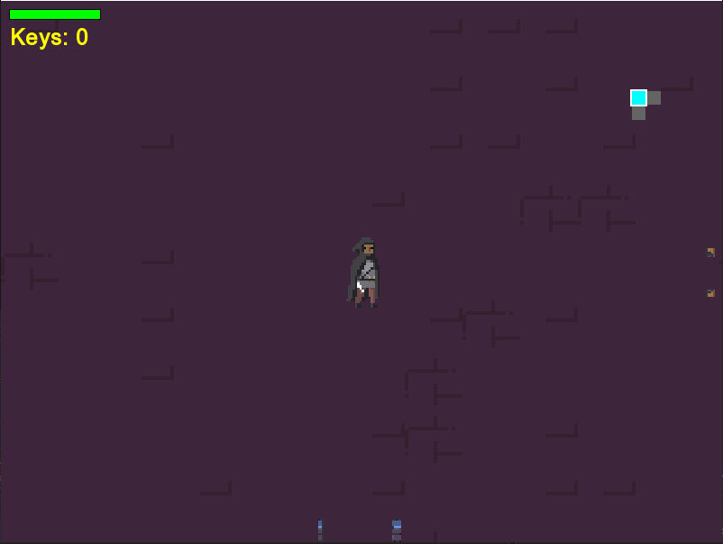

# Penitent

**Penitent** — це 2D гра в жанрі Roguelike, написана на C++ з використанням бібліотеки SFML. Герой має подолати підземелля, боротися з ворогами та збирати артефакти.

## 📸 Скріншоти

🚀 Як встановити та запустити
1. Перейдіть у вкладку Releases у цьому репозиторії.
2. Завантажте останній файл інсталятора Penitent v0.2.exe.
3. Запустіть завантажений .exe файл і дотримуйтесь інструкцій майстра встановлення.
4. Після завершення встановлення запустіть гру за допомогою ярлика на робочому столі або файлу Penitent.exe у папці встановлення.

## 🎮 Управління
- **W, A, S, D** — переміщення
- **Ліва кнопка миші** — атака
- **Пробіл** - перекид
- **E** - взаємодія
- **R** - рестарт після поразки

## 🛠 Технології
- C++
- SFML

## 👤 Автор
- Іванов Максим - Розробник
