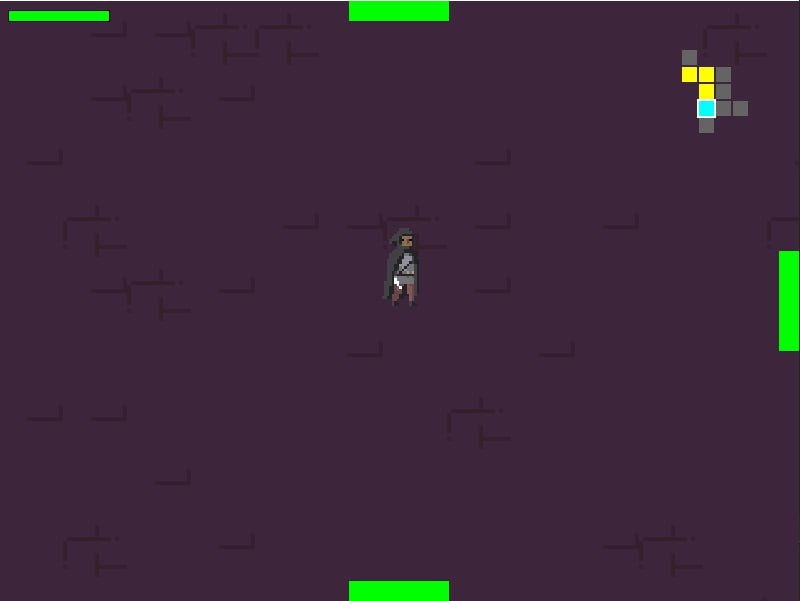

# Penitent

**Penitent** — це 2D гра в жанрі Roguelike, написана на C++ з використанням бібліотеки SFML. Герой має подолати підземелля, боротися з ворогами та збирати артефакти.

## 📸 Скріншоти

## 🚀 Як встановити та запустити
1. Перейдіть у вкладку [Releases](https://github.com/maxOMG228/penitent/releases).
2. Завантажте архів `penitent.game.v0.1.rar`.
3. Розпакуйте архів у будь-яку папку.
4. Запустіть файл `Penitent.exe`.

## 🎮 Управління
- **W, A, S, D** — переміщення
- **Ліва кнопка миші** — атака
- **Пробіл** - перекид
- **E** - взаємодія
- **R** - рестарт після поразки

## 🛠 Технології
- C++
- SFML

## 👤 Автор
- Іванов Максим - Розробник
